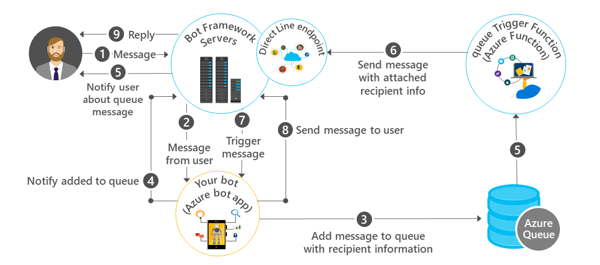

# Proactive bot

The most common bot use case is when a user initiates the interaction by chatting with the bot via their favorite channel. What if you wanted to have the bot contact the user based on a triggered event, lengthy job order, or an external event such as a state change in the system, like the pizza is ready to pick up? The proactive bot template is designed to do just that!

The proactive bot template provides all the Azure resources you need to enable a very simple proactive scenario. The following diagram provides an overview of how triggered events work.

When you create a proactive bot with the Azure Bot Service, you will find these Azure resources in your resource group:
- Azure Storage (used to create the queue)
- Azure Bot Service (your bot). This contains the logic that receives the message from user, adds the message with required properties (such as recipient and the user’s message) to the Azure queue, receives the triggers from Azure Function, and then sends back the message it received from trigger’s payload.
- Azure Function App (a queueTrigger Azure Function). This is triggered whenever there is a message in the queue and then communicates to the Bot service via Direct Line. This function uses bot binding to send the message as part of the trigger’s payload. Our example function forwards the user’s message as is from the queue.

Everything is properly configured and ready to work.

##Azure Bot Service: Receiving a message from the user and adding it to an Azure Storage Queue

Here’s the snippet of code that receives the message from the user, adds it to an Azure Storage Queue, and finally sends back an acknowledgment to the user. Notice that the message is wrapped in an object that contains all the information needed to send the message back to the user on the right channel (`ResumptionCookie` for C# and `session.message.address` for Node.js).

[!code-csharp[Receive Message](../includes/code/azure-proactive-bot.cs#receiveMessage)] 

[!code-JavaScript[Receive Message](../includes/code/azure-proactive-bot.js#receiveMessage)] 

##Azure Bot Service: Receiving the message back from the Azure Function

The following snippet of code, shows how to receive the message from the trigger function.

[!code-csharp[Receive message from trigger](../includes/code/azure-proactive-bot.cs#receiveTrigger)] 

[!code-JavaScript[Receive message from trigger](../includes/code/azure-proactive-bot.js#receiveTrigger)] 

##Triggering an Azure Function with the queue, and sending the message back to the user (Azure Functions)

After the message is added to the queue, the function is triggered. The message is then removed from the queue and sent back to the user. If you inspect the function’s configuration file, you will see that it contains an input binding of type `queueTrigger` and an output binding of type `bot`.

The **functions.json** configuration file looks like this.

[!code-JavaScript[Queue Trigger json](../includes/code/azure-proactive-bot.js#queueTriggerJson)] 

[!code-csharp[return Message](../includes/code/azure-proactive-bot.cs#returnMessage)] 

[!code-JavaScript[Queue Trigger](../includes/code/azure-proactive-bot.js#queueTrigger)] 

##Conclusion

This template should give you the basic ideas about how to enable proactive scenarios for your bots. By leveraging the power of Azure Bot Service and Azure Functions, you can build complex systems really fast with fault-tolerant, independent pieces.

##Resources

<a href="https://github.com/Microsoft/BotBuilder-Samples" target="_blank">Bot Builder Samples GitHub Repo </a>

<a href="https://docs.botframework.com/en-us/csharp/builder/sdkreference/" target="_blank">Bot Builder SDK C# Reference</a>

<a href="https://github.com/Microsoft/BotBuilder-Samples" target="_blank">Bot Builder SDK</a>
