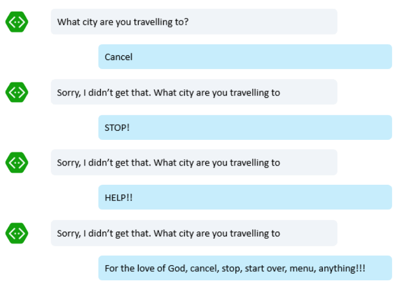
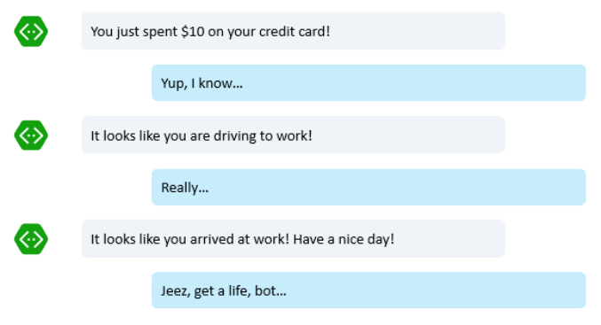

# Designing navigation

## Introduction to bot navigation

Users can navigate websites using breadcrumbs, apps using menus, and a web browsers using buttons like **forward** and **back**. 
However, none of these well-established navigation techniques entirely addresses navigation requirements within a bot. 
As we discussed [previously](bot-framework-design-core-dialogs.md#dialogs-stacks-and-humans), 
users often interact with bots in a non-linear fashion, 
thereby making it challenging to design bot navigation that consistently delivers a great user experience. 
Consider the following dilemmas:

- How do you ensure that a user doesn't get lost in a conversation with a bot? 
- Can a user navigate "back" in a conversation with a bot? 
- How does a user navigate to the "main menu" during a conversation with a bot? 
- How does a user "cancel" an operation during a conversation with a bot? 

The specifics of your bot's navigation design will depend largely upon the features and functionality that your bot supports. 
However, regardless of the type of bot you're developing, you'll want to avoid the common pitfalls of poorly designed conversational interfaces. 
This article describes these pitfalls in terms of five personality disorders: the "stubborn bot", the "clueless bot", 
the "mysterious bot", the "captain obvious bot", and the "bot that can't forget." 

## The "stubborn bot"

The stubborn bot insists upon maintaining the current course of conversation, 
even when the user attempts to steer things in a different direction. 
Consider the following scenario: 

Users often change their minds -- they can decide to cancel something in mid-stream, or sometimes want to start over altogether. 

> [!TIP]
> <b>Do</b>: Design your bot to take into account that a user might attempt to change the course of the conversation at any time. 
>
> <b>Don't</b>: Design your bot to ignore user input and keep repeating the same question in an endless loop. 

There are many methods of avoiding this pitfall, 
but perhaps the easiest way to prevent a bot from asking the same question endlessly 
is to simply specify a maximum number of retry attempts for each question. 
If designed in this manner, the bot is not doing anything "smart" to understand the user's input and respond appropriately, 
but will at least avoid asking the same question in an endless loop. 

## The "clueless bot"

The clueless bot responds in a nonsensical manner when it doesn't understand a user's attempt to access certain functionality (ex: "help" or "cancel"). 
Consider the following scenario: 

Users often attempt to access certain functionality by using common keywords like "help", "cancel", or "start over". 
Although you may be tempted to design each and every dialog within your bot to listen for (and respond appropriately to) certain keywords, 
we do not recommend this approach. 

> [!TIP]
> <b>Do</b>: Implement a "catch all" handler that will examine user input for the keywords that you specify (ex: "help", "cancel", "start over", etc.) 
> and respond appropriately. 
> 
> <b>Don't</b>: Design each and every dialog to examine user input for a list of keywords. 

By defining the logic once in a "catch all" handler, you're making it accessible to all dialogs, while ensuring that the list of keywords will be easy to maintain in the future. 
For example, you could add a new keyword to the list at any time by simply updating the "catch all" handler (thereby making it accessible to all dialogs). 
Using this approach, individual dialogs and prompts can then be made to safely ignore the keywords, if necesssary.

## The "mysterious bot"

The mysterious bot fails to immediately acknowledge the user's input in any way. 
Consider the following scenario: 

In some cases, this situation might be an indication that the bot is in the midst of an outage. 
Often times though, it could just be that the bot is busy processing the user's input and hasn't yet finished compiling its response. 

> [!TIP]
> <b>Do</b>: Design your bot to immediately acknowledge user input, even in cases where the bot may take some time to compile its response. 
> 
> <b>Don't</b>: Design your bot to postpone acknowledgement of user input until the bot finishes compiling its response.

By immediately acknowledging the user's input, you eliminate any potential for confusion as to the state of the bot.

## The "captain obvious bot"

The captain obvious bot provides unsolicited information that is completely obvious and therefore useless to the user. 
Consider the following scenario:

> [!TIP]
> <b>Do</b>: Design your bot to provide information that will be useful to the user. 
> 
> <b>Don't</b>: Design your bot to provide unsolicited information that is unlikely to be useful to the user.

By designing your bot to provide useful information, you're increasing the odds that the user will engage with your bot.

## The "bot that can't forget"

The bot that can't forget inappropriately integrates information from past conversations into the current conversation. 

Consider the following scenario:

> [!TIP]
> <b>Do</b>: Design your bot to maintain the current topic of conversation, unless/until the user expresses a desire to revisit a prior topic. 
> 
> <b>Don't</b>: Design your bot to interject information from past conversations when it is not relevant to the current conversation.

By maintaining the current topic of conversation, you reduce the potential for confusion and frustration and increase the odds that the user will continue to engage with your bot.

## Next steps

By designing your bot to avoid these common pitfalls of poorly designed conversational interfaces, 
you're taking an important step toward ensuring a great user experience. 
Next, learn more about the [UX elements](bot-framework-design-core-ux-elements.md) that bots most typically rely upon to exchange information with users. 