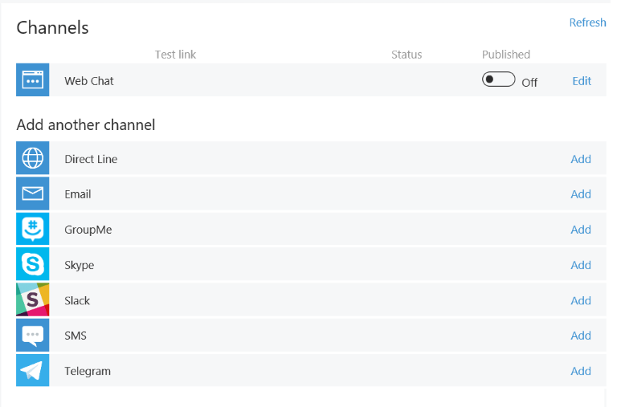

# Bot embedded within an app 

##When bots live inside apps 

Similar to what discussed in [bots in Websites article](bot-framework-design-patterns-bot-in-website.md), bots can also exist inside apps. It is important to clarify that kind of apps discussed can vary significantly. Examples:

- Native mobile apps: Apps created in native code which then communicate with the bot framework by using the [DirectLine API](https://docs.botframework.com/en-us/restapi/directline3/#navtitle), either via REST or websockets
- Web based mobile apps: Many mobile apps are built using web language and frameworks such as [Cordova](https://cordova.apache.org/). In this case, the app is mostly built as a mobile website and may even use the same components discussed in the [bots in Websites article](bot-framework-design-patterns-bot-in-website.md), but now wrapped into a native app's shell.
- IoT apps: These may vary largely, from devices without screens (basically just using audio/speech capabilities), appliances, robots, etc. Like with native apps, these devices will be using the [DirectLine API](https://docs.botframework.com/en-us/restapi/directline3/#navtitle) in order to communicate with the Microsoft Bot Framework. They may as well make use of other [Microsoft Cognitive Services](https://www.microsoft.com/cognitive-services/) - such as Vision and Speech - as needed to fulfill the scenarios accordingly.
- Other apps and games: Apps and games built on a diversity of platforms can also leverage these APIs. From business desktop based apps to [Unity 3D](https://unity3d.com/) based games, they can still leverage the same [DirectLine API](https://docs.botframework.com/en-us/restapi/directline3/#navtitle) discussed

##A cross platform mobile app that runs a bot

[Xamarin](https://www.xamarin.com/) is the best tool for building cross platform mobile applications. So in this sample we take a very simple web view component and use it to host our [Open Source Web Control](https://github.com/Microsoft/BotFramework-WebChat). Then we enable the web chat as a channel in the bot registration:

We then use the registered web chat URL into the web view control in the Xamarin app:

	public class WebPage : ContentPage
	{
    	public WebPage()
    	{
    		var browser = new WebView();
        	browser.Source = "https://webchat.botframework.com/embed/<YOUR SECRET KEY HERE>";
        	this.Content = browser;
    	}
	}

The result is a true cross platform mobile application with complete control over look and feel, rendering the embedded web view with the web chat control:

More details:
- Here is the [full code example in C#](https://trpp24botsamples.visualstudio.com/_git/Code?fullScreen=true&path=%2FCSharp%2Fcapability-BotInApps&version=GBmaster&_a=contents) and a [more detailed step by step guidance](https://trpp24botsamples.visualstudio.com/_git/Code?fullScreen=true&path=%2FCSharp%2Fcapability-BotInApps%2FREADME.md&version=GBmaster&_a=contents) on how to set up the entire application

TODO: Unity, backchannel pattern
 