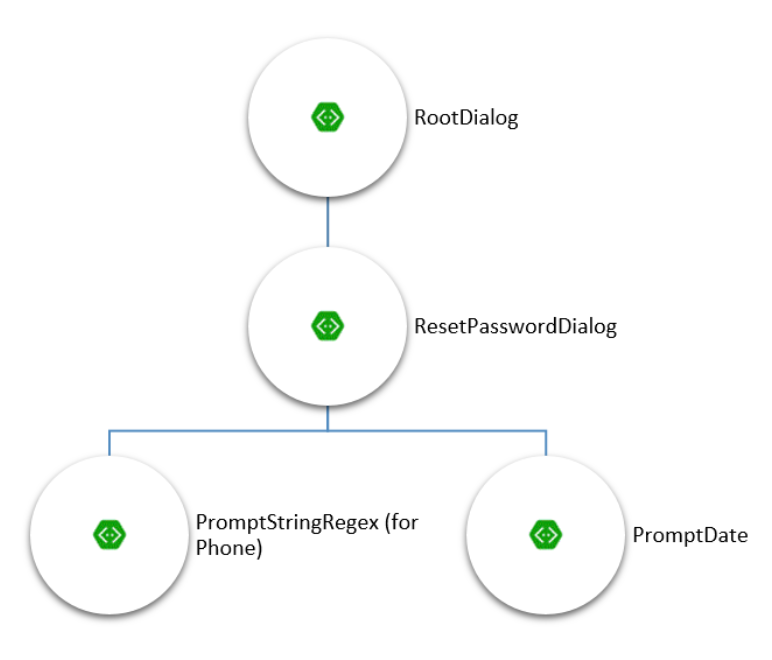
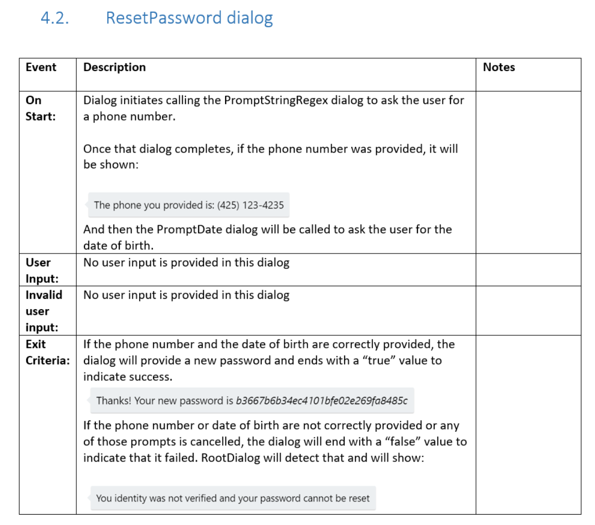

# Task automation bots

A task automation bot enables the user to complete a specific task or set of tasks without any assistance from a human. 
This type of bot often closely resembles a typical app or website, communicating with the user primarily via rich user controls and text. 
It may have natural language understanding capabilities to enrich conversations with users. 

## Example use case: password-reset

To better understand the nature of a task bot, consider an example use case: password-reset. 
The Contoso company receives several help desk calls each day from employees who need to reset their passwords. 
Contoso wants to automate the simple, repeatable task of resetting a employee's password so that help desk agents 
can devote their time to addressing more complex issues. 

John, an experienced developer from Contoso, decides to create a bot to automate the password-reset task. 
He begins by writing a design specification for the bot, just as he would do if he were creating a new app or website. 

### Navigation model

The specification defines the navigation model:

The user begins at the `RootDialog`. When they request a password reset, they  
will be directed to the `ResetPasswordDialog`. 
With the `ResetPasswordDialog`, the bot will prompt the user for two pieces of information: phone number and birth date. 

> [!IMPORTANT]
> The bot design described in this article is intended for example purposes only. 
> In real-world scenarios, a password-reset bot would likely implement a more robust identity verification process.

### Dialogs

Next, the specification describes the appearance and functionality of each dialog. 

#### Root dialog

The root dialog provides the user with two options: 

1. **Change Password** is for scenarios where the user knows their current password and simply wants to change it.
2. **Reset Password** is for scenarios where the user has forgotten or misplaced their password and needs to generate a new one.

> [!NOTE]
> For simplicity, this article describes only the **reset password** flow.

The specification describes the root dialog as shown in the following screenshot.

#### ResetPassword dialog

When the user chooses **Reset Password** from the root dialog, the `ResetPassword` dialog is invoked. 
The `ResetPassword` dialog then invokes two other dialogs. 
First, it invokes the `PromptStringRegex` dialog to collect the user's phone number. 
Then it invokes the `PromptDate` dialog to collect the user's date of birth. 

> [!NOTE]
> In this example, John chose to implement the logic for collecting the user's phone number 
> and date of birth by using two separate dialogs. 
> The approach not only simplifies the code required for each dialog, but also increases the odds of these 
> dialogs being useable by other scenarios in the future. 

The specification describes the `ResetPassword` dialog.

#### PromptStringRegex dialog

The `PromptStringRegex` dialog prompts the user to enter their phone number, and verifies that the phone number 
that the user provides matches the expected format. 
It also accounts for the scenario where the user repeatedly provides invalid input. 
The spec describes the `PromptStringRegex` dialog.

### Prototype

Finally, the spec provides an example of a user communicating with the bot to successfully complete the password-reset task.

## Bot, app, or website?

You may be wondering, if a task automation bot closely resembles an app or website, why not just build an app or website instead? 
Depending on your particular scenario, building an app or website instead of a bot may be an entirely reasonable choice. 
You may even choose to embed your bot into an app, by using the [Bot Framework Direct Line API](https://docs.botframework.com/en-us/restapi/DirectLine3/#navtitle) 
or <a href="https://github.com/Microsoft/BotFramework-WebChat" target="_blank">Web Chat control</a>. 
Implementing your bot within the context of an app provides the best of both worlds: a rich app experience and a conversational experience, all in one place. 

In many cases, however, building an app or website can be significantly more complex and more expensive than building a bot. 
An app or website often needs to support multiple clients and platforms, packaging and deploying 
can be tedious and time-consuming processes, and the user experience of having to download and install an app is not necessarily ideal. 
For these reasons, a bot may often provide a much simpler way of solving the problem at hand. 

Additionally, bots provide the freedom to easily expand and extend. 
For example, a developer may choose to add natural language and speech capabilities to the password-reset bot so that it can be accessed via audio call, 
or she may add support for text messages. 
The company may setup kiosks throughout the building and embed the password-reset bot into that experience.

## Additional resources

- [Dialogs](~/dotnet/dialogs.md)
- [Manage conversation flow using .NET](~/dotnet/manage-conversation-flow.md)
- [Manage conversation flow using Node.js](bot-framework-nodejs-howto-manage-conversation-flow.md)

<!-- 
This article explored how a task automation bot can be designed to enable users to complete a specific task or set of tasks. 
To access the sample code for the password-reset bot described in this article, see: 

> [!NOTE]
> To do: Add links to the C# and Node.js code samples that Mat refers to.-->
