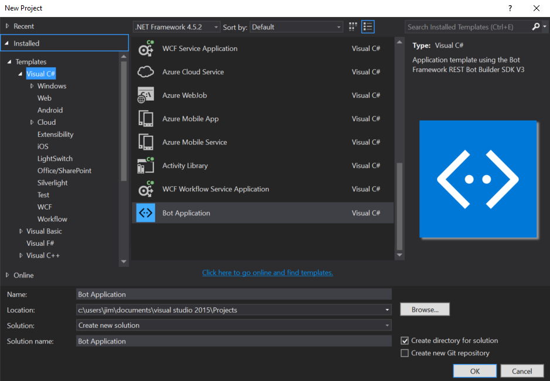
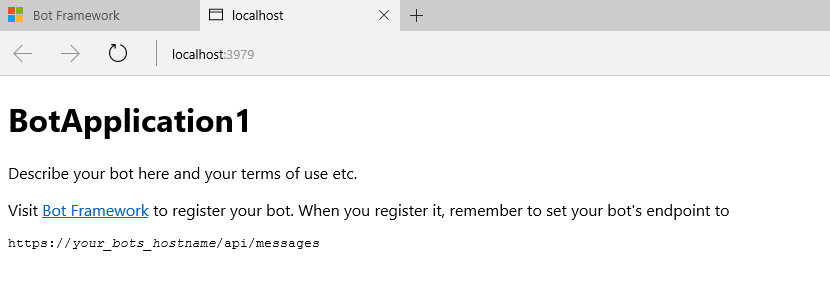

# Create a bot with the Bot Builder SDK for .NET
> [!div class="op_single_selector"]
> * [.NET](bot-framework-dotnet-getstarted.md)
> * [Node.js](bot-framework-nodejs-getstarted.md)
> * [Azure Bot Service](bot-framework-azure-getstarted.md)
>

The <a href="https://github.com/Microsoft/BotBuilder" target="_blank">Bot Builder SDK for .NET</a> is a powerful
framework for constructing bots that can handle both freeform interactions and more guided ones where the
possibilities are explicitly shown to the user.
It is easy to use and leverages C# to provide a familiar way for .NET developers to write bots.

In this tutorial, we'll walk through the process of building a bot by using
the Bot Application template and the Bot Builder SDK for .NET,
and testing it with the Bot Framework Emulator.

> [!NOTE]
> At this time, the Bot Builder SDK for .NET supports only C#.

## Prerequisites

Get started by completing the following prerequisite tasks:

1. Install Visual Studio 2015.  
> [!TIP]
> The Community edition of Visual Studio 2015 is available <a href="https://www.visualstudio.com/downloads/" target="_blank">here</a> for free.

2. In Visual Studio, update all extensions to their latest versions (by following the instructions <a href="https://msdn.microsoft.com/en-us/library/dd997169.aspx" target="_blank">here</a>).

3. Click [here](http://aka.ms/bf-bc-vstemplate) to download the Bot Application template
and install the template by saving the .zip file to your Visual Studio 2015 project templates directory.  
> [!TIP]
> The Visual Studio 2015 project templates directory is typically located here:
> `%USERPROFILE%\Documents\Visual Studio 2015\Templates\ProjectTemplates\Visual C#\`

## Create your bot

Next, open Visual Studio and create a new C# project by using the Bot Application template.

By using the Bot Application template, you're creating a project that already contains all of the
components that are required to build a simple bot, including a reference to
the Bot Builder SDK for .NET (**Microsoft.Bot.Builder**). Verify that the project
references the latest version of the SDK by completing the following steps:

- Right-click on the project and select **Manage NuGet Packages**.
- In the **Browse** tab, type "Microsoft.Bot.Builder".
- Locate the "Microsoft.Bot.Builder" package in the list of search results, and click the **Update** button (if present) for that package.
- Follow the prompts to accept the changes and update the package.

At this point (thanks to the Bot Application template),
your project contains all of the code that's necessary to create the bot in this tutorial --
you won't actually need to write any additional code.
However, before we move on to testing your bot,
let's take a quick look at some of the code that the Bot Application template provided.

## Explore the code

The `Post` method within **Controllers\MessagesController.cs** represents the
core functionality of your bot.

[!include[echobot code sample C#](../includes/code/csharp-echobot.md)]

This method receives a message from the user and creates a reply
(by using the **CreateReply** function) that echos back the user's message,
prefixed with the text 'You sent' and ending in the text 'which was *##* characters'
(where *##* represents the number of characters in the user's message).
The `[BotAuthentication]` decoration on the method validates your Bot Connector credentials over HTTPS.

## Test your bot

[!include[Get started test your bot](../includes/snippet-getstarted-test-bot.md)]

### Start your bot

After installing the emulator, start your bot via Visual Studio by using a browser as the application host.
The following Visual Studio screenshot shows that the bot will launch in Microsoft Edge when the run button is clicked.

When you click the run button, Visual Studio will build the application, deploy it to localhost,
and launch the web browser to display the application's **default.htm** page.
For example, here's the application's **default.htm** page shown in Microsoft Edge:

> [!NOTE]
> You can modify the **default.htm** file within your project
> to specify the name and description of your bot application.

### Start the emulator and connect your bot

At this point, your bot is running locally.
Next, start the emulator and then connect your bot by completing the following tasks in the emulator:

1. Type **http://localhost:port-number/api/messages** into the address bar -- where **port-number** matches the port number shown in the browser where your application is running.  
> [!TIP]
> In the example shown above, the application is running on port number **3978**, so the emulator address would be set to: http://localhost:3978/api/messages.

2. Click **Connect**. (You won't need to specify **Microsoft App ID** and **Microsoft App Password** -- you can leave these fields blank for now. You'll get this information later if/when you register your bot with the framework.)

### Test your bot

Now that your bot is running locally and is connected to the emulator, test your bot by typing a few messages in the emulator.
You should see that the bot responds to each message you send by echoing back your message prefixed with the text 'You sent'
and ending with the text 'which was *##* characters' (where *##* is the total number of characters in the message that you sent).

Congratulations -- you've successfully created a bot by using the Bot Application template Bot Builder SDK for .NET!

## Next steps

In this tutorial, you created a simple bot by using the Bot Application template and the Bot Builder SDK for .NET
and verified the bot's functionality by using the Bot Framework Emulator.
If you'd like to share your bot with others, you'll need to
[register](bot-framework-publish-register.md) it with the Bot Framework and
[deploy](bot-framework-publish-deploy.md) it to the cloud.

To learn more about building great bots with the Bot Framework, see the following articles:

- [Key concepts in the Bot Framework](bot-framework-concepts-overview.md)
- [Introduction to bot design](bot-framework-design-overview.md)
- TBD (develop articles)
- [Publish a bot to the Bot Framework](bot-framework-publish-overview.md)
- TBD (resources articles)
