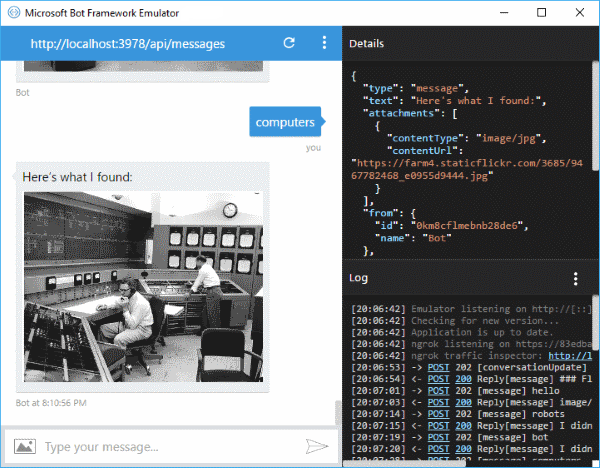
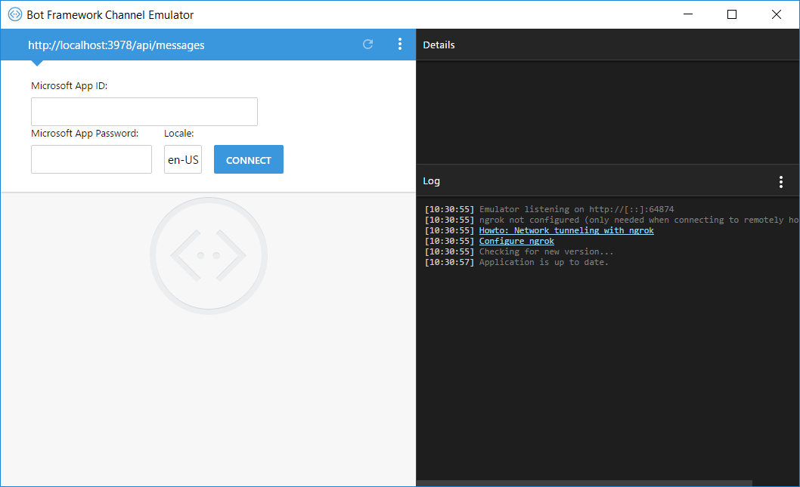

# Bot Framework Emulator
The Bot Framework Emulator is a desktop application that allows bot developers to test and debug their bots, either locally or remotely. 
You use the emulator to inspect the messages that your bot sends and receives to ensure they are properly configured. 
The emulator displays messages as they would appear in a web chat UI and lets you view JSON responses from your bot. <!-- and log -->

> [!TIP] 
> When you develop your bot, try your Bot's web service locally in the emulator first, before deploying to the cloud. 
> A main advantage of using the emulator is that you don't have register it with the Bot Framework or configure it on a channel before you can test it. 

## Before you get started
* Download and run the Bot Framework Emulator. Download packages for Mac, Windows, and Linux are available from the [GitHub releases page](https://github.com/Microsoft/BotFramework-Emulator/releases). The latest Windows installer is available from the [emulator download page](https://emulator.botframework.com) (download starts immediately).
* Know what to enter for your bot's endpoint into the emulator's address bar. This value differs based on whether your bot is [running on localhost](#localhost), [hosted remotely](#remotehost), or [running as an Azure Bot Service](#azurehost).
* If your bot is running with Microsoft Account (MSA) credentials, have those credentials ready too.
* If your bot is hosted remotely, ensure that [ngrok tunneling software](#ngrok) is installed and configured so that the emulator can communicate with the service.

##  Connect to a bot running on localhost
When developing a bot using the BotBuilder SDK, the default endpoint for local debugging is http://localhost:3978/api/messages. This is where the bot will be listening for messages when hosted locally.

For localhost debugging you will not typically need to enter the MSA appId or password, although it is supported if your bot requires it.

To connect, enter your bot's endpoint into the address bar and click on the Connect button:

##  Connect to a bot hosted remotely
This scenario is similar to the localhost scenario, but with two additional requirements:
* You will need to enter your bot's MSA appId and password.
* You must run tunneling software [(ngrok)](#ngrok) so that the remotely hosted bot can reply to you.  

If you registered your bot with the Bot Framework, you can retrieve endpoint and MSA appId from its registration page. If you do not already know the MSA password of your bot, 
a new one can be generated from the <a href="https://dev.botframework.com/" target="_blank">registration page</a>.

##  Connect to an Azure Bot Service
This scenario is similar to the [remotely hosted scenario](#remotehost), in that when you create an [Azure Bot Service][AzureBotServices], 
a registration for it is created with the Bot Framework. You can find your endpoint on your bot's registration page on the <a href="https://dev.botframework.com/" target="_blank">Bot Framework Dev Portal</a>.

> [!TIP]
> If you want to [debug your Azure Bot Service Bot][AzureBotDebug] code in your IDE, instead of relying only on the visual inspection and logs provided by the emulator, you can set up [continuous integration][AzureBotContinuousIntegration].

## Using ngrok
If you're running the Bot Framework Emulator behind a firewall or other network boundary and want to connect to a bot hosted remotely, you will need to install and configure tunneling software.
Computers running behind firewalls and home routers are not able to accept ad-hoc incoming requests from the outside world. 
Tunneling software provides a way around this by creating a bridge from outside the firewall to your local machine. The [ngrok][ngrokDownload] tool, developed by [inconshreveable][inconshreveable], is an example of such tunneling software.

The Bot Framework Emulator integrates tightly with ngrok and can launch it for you when it is needed.

### Installing & Configuring ngrok

1. Download the [ngrok][ngrokDownload] executable to your local machine
2. Configure the path to ngrok in the emulator's App Settings dialog

When the emulator connects to a remotely hosted bot, it displays messages in its log that indicate it's automatically launched ngrok.

If you've followed these steps but the emulator's log indicates that it is not able to launch ngrok, ensure you have ngrok version 2.1.18 or later. Earlier versions have been known to be incompatible.
To check ngrok's version, from the command line:

<code>ngrok -v</code>

## Sending System Activities
The Bot Framework Emulator lets you send messages that represent [activities][ActivityConcept]. This feature allows you to emulate a specific user or conversation.

You can find the following activities under **Conversation** > **Send System Activity** in the emulator's settings menu:
* conversationUpdate (user added)
* conversationUpdate (user removed)
* contactRelationUpdate (bot added)
* contactRelationUpdate (bot removed)
* typing
* ping 
* deleteUserData

## Troubleshooting

### Where can I find more information on using the emulator for debugging?
For more tips on troubleshooting and debugging your bot, see the [Bot Framework Troubleshooting Guide][TroubleshootingGuide].

### How do I use the emulator to troubleshoot authentication problems?
See [Troubleshooting Authentication issues][TroubleshootingAuth].

## Next Steps

To get started building a simple bot that you can try with the emulator, see:
* [Create a bot with the Bot Builder SDK for Node.js][NodeGetStarted].
* [Create a bot with the Bot Builder SDK for .NET][CSGetStarted].

For more information on how to register, configure and deploy your bot, see:
* [Publish a bot with the Bot Framework][BotFrameworkPublishOverview]

The Bot Framework Emulator is open source. To contribute or file bugs and suggestions, see:
* [How to Contribute][EmulatorGithubContribute]
* [Submitting Bugs and Suggestions][EmulatorGithubBugs]

[EmulatorGithub]: https://github.com/Microsoft/BotFramework-Emulator
<!-- NOTE: I think the details of how to contribute, like the Contributor License Agreement, 
should remain on GitHub instead of here -->
[EmulatorGithubContribute]: https://github.com/Microsoft/BotFramework-Emulator/wiki/How-to-Contribute
[EmulatorGithubBugs]: https://github.com/Microsoft/BotFramework-Emulator/wiki/Submitting-Bugs-%26-Suggestions

[ngrokDownload]: https://ngrok.com/
[inconshreveable]: https://inconshreveable.com/
[BotFrameworkDevPortal]: https://dev.botframework.com/

<!--TODO: Update these links to point to new content when it's available -->
[AzureBotServices]: https://docs.botframework.com/en-us/azure-bot-service/
[AzureBotContinuousIntegration]: https://docs.botframework.com/en-us/azure-bot-service/manage/setting-up-continuous-integration/#navtitle
[AzureBotDebug]: https://docs.botframework.com/en-us/azure-bot-service/manage/debug/#navtitle
[AzureBotDebugCS]: https://docs.botframework.com/en-us/azure-bot-service/manage/debug/#debugging-c-bots-built-using-the-azure-bot-service-on-windows

[EmulatorConnectPicture]: media/emulator/emulator-connect_localhost_credentials.png
[EmulatorNgrokPath]: media/emulator/emulator-configure_ngrok_path.png
[EmulatorNgrokMonitor]: media/emulator/emulator-testbot-ngrok-monitoring.png
[EmulatorUI]: media/emulator/emulator-ui-new.png

[TroubleshootingGuide]: bot-framework-troubleshooting-guide.md
[TroubleshootingAuth]: bot-framework-troubleshooting-auth.md
[NodeGetStarted]: bot-framework-nodejs-getstarted.md
[CSGetStarted]: bot-framework-dotnet-getstarted.md
[BotFrameworkPublishOverview]: bot-framework-publish-overview.md
[ActivityConcept]: bot-framework-activity-concept.md

