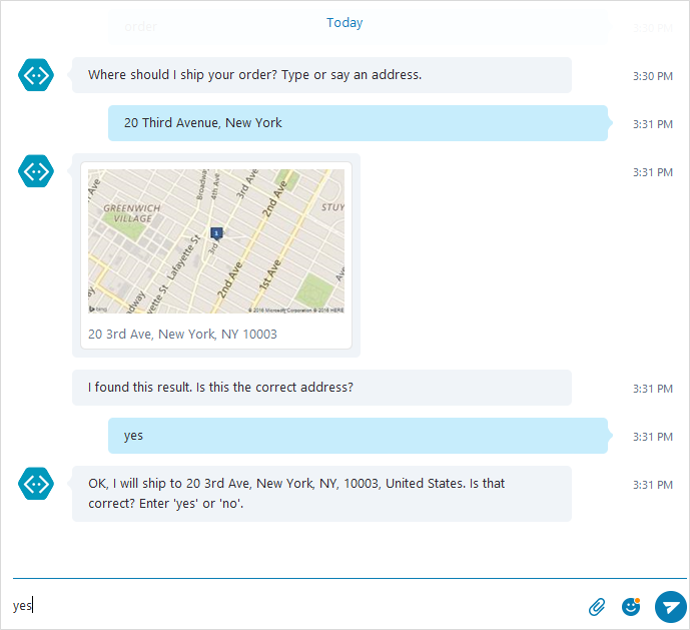
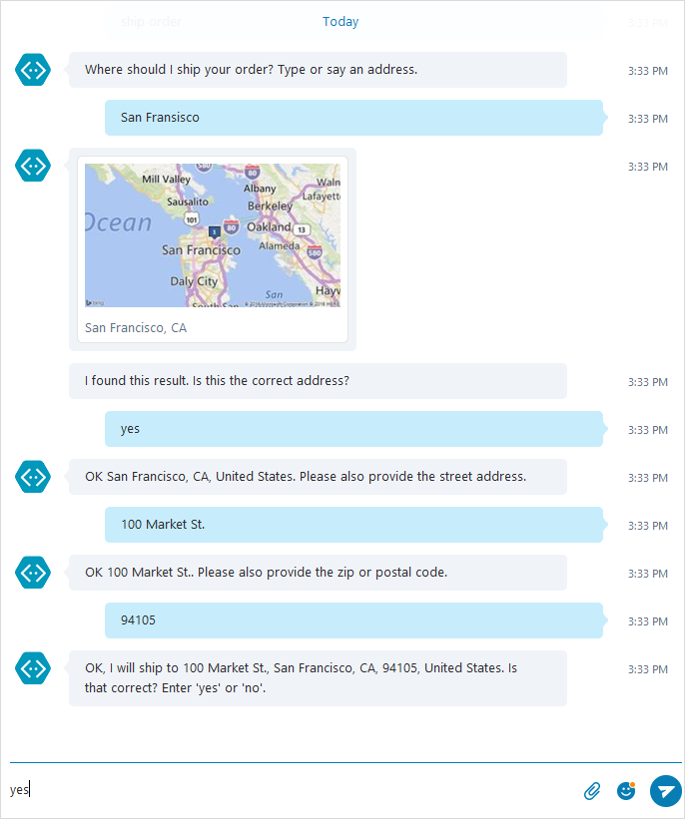
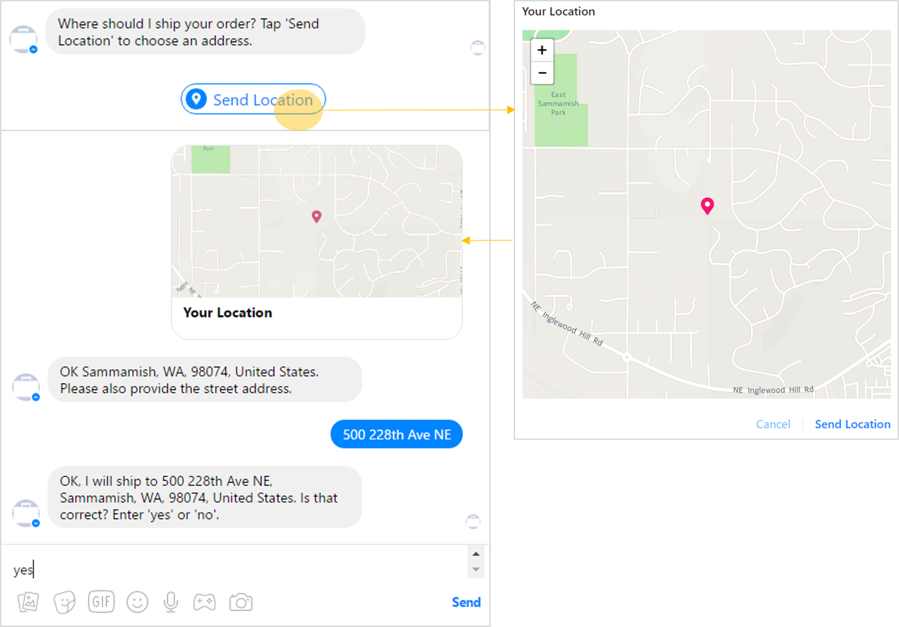

> [!WARNING]
> The content in this article is still under development. The article may have errors in content, formatting,
> and copy. The content may change dramatically as the article is developed.

# Add location control capabilities to your bot
The Bing location control for Microsoft Bot Framework makes the process of collecting and validating the user's desired location in a conversation easy and reliable. The control is available for C# and Node.js and works consistently across all channels supported by Bot Framework.


## Location control use cases for bots
Bots often need the user to input a location to complete a task. For example, a Taxi bot requires the user's pickup and destination address before requesting a ride. Similarly, a Pizza bot must know the user's delivery address to submit the order, and so on. Normally, bot developers need to use a combination of location or place APIs, and have their bots engage in a multi-turn dialog with users to get their desired location and subsequently validate it. The development steps are usually complicated and error-prone.  

The Bing location control makes this process easy by abstracting away the tedious coding steps to let the user pick a location and reliably validate it. The control offers the following capabilities:

- Address look up and validation using Bing's Maps REST services.
- Address disambiguation when more than one address is found.
- Support for declaring required location fields.
- Support for FB Messenger's location picker GUI dialog.
- Open-source code (C# and Node.js) with customizable dialog strings.

You can find screenshots of the scenarios supported by the location control in the [Examples](#examples) section.

> [!IMPORTANT]
>As a prerequisite to use the location control, you need to obtain a Bing Maps API subscription key. You can sign up to get a free key with up to 10,000 transactions per month in [Azure Portal](https://azure.microsoft.com/en-us/marketplace/partners/bingmaps/mapapis/).

The following sections describe the coding steps to add the location control to your bot. You can find the full developer guides and sample bots for [C#](https://github.com/Microsoft/BotBuilder-Location/tree/master/CSharp) and [Node.js](https://github.com/Microsoft/BotBuilder-Location/tree/master/Node) in the [BotBuilder-Location](https://github.com/Microsoft/BotBuilder-Location/tree/master/) github repository.

## Start using the location control

In C#, import the Microsoft.Bot.Builder.Location package from NuGet and add the following namespace in your code.

```cs
using Microsoft.Bot.Builder.Location;
```

In Node.js, install the BotBuilder-Location module using npm and load it.

```
npm install --save botbuilder-location    
```

```javascript
var locationDialog = require('botbuilder-location');
```

## Calling the location control with default parameters

The example initiates the location control with default parameters, which returns a custom prompt message asking the user to provide an address.

```cs
var apiKey = WebConfigurationManager.AppSettings["BingMapsApiKey"];
var prompt = "Where should I ship your order? Type or say an address.";
var locationDialog = new LocationDialog(apiKey, message.ChannelId, prompt);
context.Call(locationDialog, (dialogContext, result) => {...});
```

```javascript
locationDialog.getLocation(session,
 { prompt: "Where should I ship your order? Type or say an address." });
```

## Using FB Messenger's location picker GUI dialog

FB Messenger supports a location picker GUI dialog to let the user select an address. If you prefer to use FB Messenger's native dialog,  pass the `LocationOptions.UseNativeControl` option in the location control's constructor.  

```cs
var apiKey = WebConfigurationManager.AppSettings["BingMapsApiKey"];
var prompt = "Where should I ship your order? Type or say an address.";
var locationDialog = new LocationDialog(apiKey, message.ChannelId, prompt, LocationOptions.UseNativeControl);
context.Call(locationDialog, (dialogContext, result) => {...});
```

```javascript
var options = {
    prompt: "Where should I ship your order? Type or say an address.",
    useNativeControl: true
};
locationDialog.getLocation(session, options);
```

FB Messenger by default returns only the lat/long coordinates for any address selected via the location picker GUI dialog. You can additionally use the `LocationOptions.ReverseGeocode` option to have Bing reverse geocode the returned coordinates and automatically fill in the remaining address fields.


```cs
var apiKey = WebConfigurationManager.AppSettings["BingMapsApiKey"];
var prompt = "Where should I ship your order? Type or say an address.";
var locationDialog = new LocationDialog(apiKey, message.ChannelId, prompt, LocationOptions.UseNativeControl | LocationOptions.ReverseGeocode);
context.Call(locationDialog, (dialogContext, result) => {...});
```

```javascript
var options = {
    prompt: "Where should I ship your order? Type or say an address.",
    useNativeControl: true,
    reverseGeocode: true
};
locationDialog.getLocation(session, options);
```

> [!WARNING]
> Reverse geocoding is an inherently imprecise operation. For that reason, when the reverse geocode option is selected, the location control will collect only the `PostalAddress.Locality`, `PostalAddress.Region`, `PostalAddress.Country` and `PostalAddress.PostalCode` fields and ask the user to provide the desired street address manually.

## Specifying required fields

You can specify required location fields that need to be collected by the control. If the user does not provide values for one or more required fields, the control will prompt him to fill them in. You can specify required fields by passing them in the location control's constructor using the `LocationRequiredFields` enumeration. The example specifies the street address and postal (zip) code as required.


[!code-js[Required Fields (C Sharp)](../includes/code/intelligence-location-control.cs#specifyingRequiredFields)]
[!code-js[Required Fields (Javascript)](../includes/code/intelligence-location-control.js#specifyingRequiredFields)]

## Handling returned location

The following example shows how you can leverage the location object returned by the location control in your bot code.

```cs
var apiKey = WebConfigurationManager.AppSettings["BingMapsApiKey"];
var prompt = "Where should I ship your order? Type or say an address.";
var locationDialog = new LocationDialog(apiKey, message.ChannelId, prompt, LocationOptions.None, LocationRequiredFields.StreetAddress | LocationRequiredFields.PostalCode);
context.Call(locationDialog, (context, result) => {
    Place place = await result;
    if (place != null)
    {
        var address = place.GetPostalAddress();
        string name = address != null ?
            $"{address.StreetAddress}, {address.Locality}, {address.Region}, {address.Country} ({address.PostalCode})" :
            "the pinned location";
        await context.PostAsync($"OK, I will ship it to {name}");
    }
    else
    {
        await context.PostAsync("OK, cancelled");
    }
}
```

[!code-js[sample](../includes/code/intelligence-location-control.js#handlingReturnedLocation)]


> [!WARNING]
> TODO: Fix these images

## Examples
The examples show different location selection scenarios supported by the Bing location control.

**Address selection with single result returned**



**Address selection with multiple results returned**


**Address selection with required fields filling**



**Address selection using FB Messenger's location picker GUI dialog**


