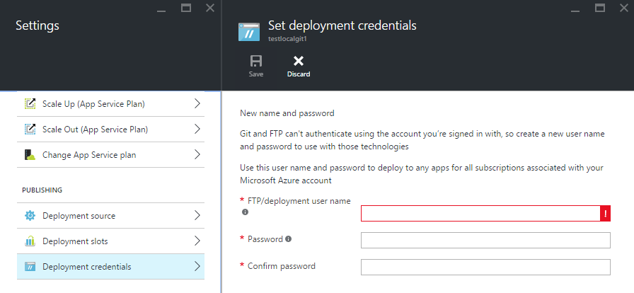
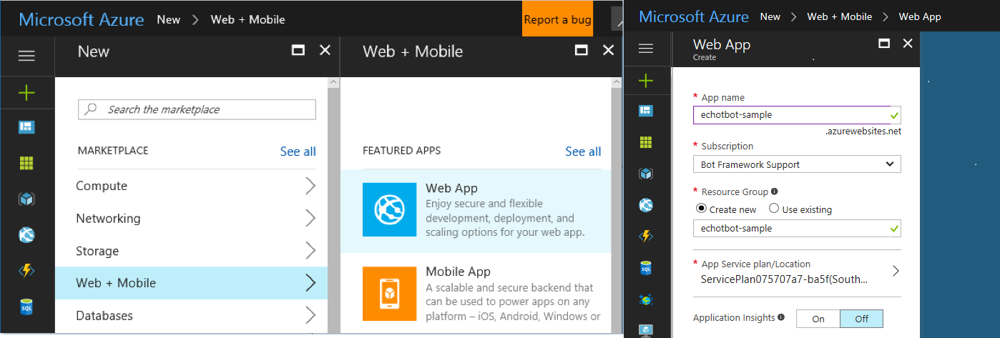
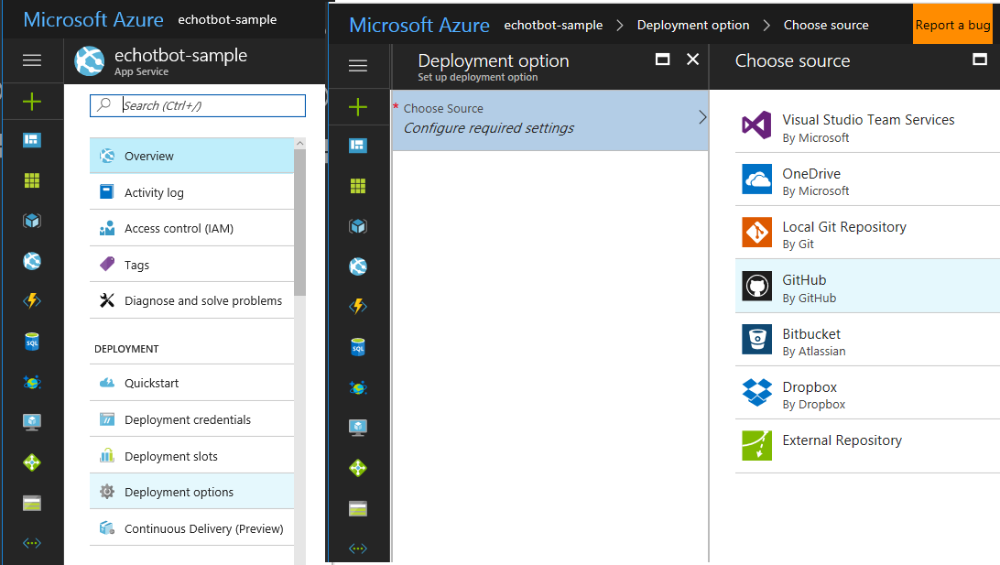
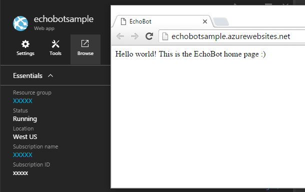
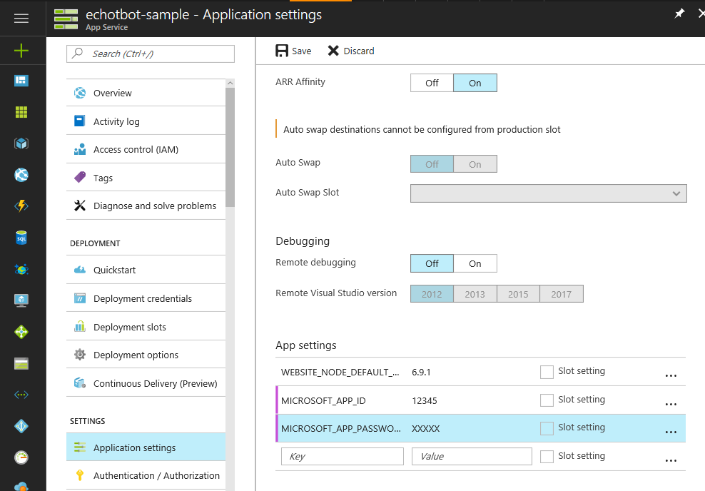
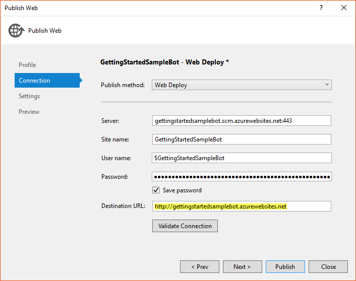

# Deploy a bot to the cloud

Before others can use your bot, you must deploy it to the cloud.
You can deploy your bot to Microsoft Azure or to any other cloud service.

## Important considerations

Regardless of which cloud service you choose to host your bot, you must address the application configuration settings and the HTTPS endpoint as part of the deployment process.

> [!NOTE]
> This article does not apply to bots that are created by using the Azure Bot Service 
> (since bot deployment is handled as part of the Azure Bot Service bot creation process).

###<a id="appSettings"></a> Application configuration settings
If you've already [registered](bot-framework-publish-register.md) your bot with the Bot Framework,
update the Microsoft App Id and Microsoft App Password values in your application's configuration settings
as part of the deployment process.
Specify the **app ID** and **password** values that were generated for your bot during registration.

> [!TIP]
[!include[Application configuration settings](../includes/snippet-tip-bot-config-settings.md)]

If you have not yet registered your bot with the Bot Framework (and therefore do not yet have an **app ID** and **password**),
you can deploy your bot with temporary placeholder values for these settings.
Then later, after you register your bot, update your deployed application's settings with the **app ID** and **password** values that were generated for your bot during registration.

###<a id="httpsEndpoint"></a> HTTPS endpoint
Your deployed bot must have an **HTTPS** endpoint that can receive messages from the Bot Framework Connector Service.

> [!NOTE]
> When you deploy your bot to Azure, SSL will automatically be configured for your application, thereby enabling the **HTTPS** endpoint that the Bot Framework requires.
> If you deploy to another cloud service, be sure to verify that your application is configured for SSL so that the bot will have an **HTTPS** endpoint.

This article provides detailed walkthroughs of the different options for deploying your bot to Azure.

> [!NOTE]
> You must have a Microsoft Azure subscription before you can deploy your bot to Microsoft Azure.
If you do not already have a subscription, you can register for a [free trial](https://azure.microsoft.com/en-us/free/).

## <a id="git"></a>Deploy a Node.js bot to Azure via continuous integration

Azure allows continuous integration of your Git repository with your Azure deployment.
With continuous integration, when you change and build your bot's code, the bot will automatically deploy to Azure.
The process of deploying a bot via continuous integration from local Git consists of the following steps:

1. [Install the Azure CLI](#git1)
2. [Create and configure an Azure site](#git2)
3. [Commit changes to Git and push to the Azure site](#git3)
4. [Test the connection to your bot](#git4)

### <a id="git1"></a>Step 1: Install the Azure CLI

Install the Azure CLI by following the instructions <a href="https://docs.microsoft.com/en-us/azure/xplat-cli-install" target="_blank">here</a>.

### <a id="git2"></a>Step 2: Create and configure an Azure site

Login to your Azure account by running this command at the command prompt and following the instructions:

```
azure login
```

Next, run the following command to create a new Azure site and configure it for Git (where *\<appname\>* is the name of the site that you want to create):

```
azure site create --git <appname>
```

> [!TIP]
> The URL of the site that is created will be in the following format: *https://appname.azurewebsites.net*.

### <a id="git3"></a>Step 3: Commit changes to Git and push to the Azure site

To update the site with your latest changes, run the following commands to commit the changes and push those changes to the Azure site:

```
git add .
git commit -m "<your commit message>"
git push azure master
```

You will be prompted to enter your deployment credentials.
If you don't yet have them, you can configure them on the Azure Portal by following these steps:

1. Login to the <a href="http://portal.azure.com" target="_blank">Azure Portal</a>
2. Click the site that you've just created
3. Open the **Settings** blade
4. In the **PUBLISHING** section, click **Deployment credentials**, specify a username and password, and click save  

5. Return to the command prompt and provide the deployment credentials as requested

After you've entered your deployment credentials at the command prompt, your bot will be deployed to the Azure site.

### <a id="git4"></a>Step 4: Test the connection to your bot

[!include[Verify connection to your bot](../includes/snippet-verify-deployment-using-emulator.md)]

### Next steps

After you've successfully verified the connection to your bot, see [next steps](#next).

## <a id="github"></a>Option 2: Deploy a Node.js bot to Azure (via continuous integration from GitHub)

> [!IMPORTANT]
> To implement this process, you must have a <a href="http://github.com/" target="_blank">GitHub</a> account.

Azure allows continuous integration of your Git repository with your Azure deployment.
With continuous integration, when you change and build your bot's code, the bot will automatically deploy to Azure.
The process of deploying a bot via continuous integration from GitHub consists of the following steps:

1. [Get a GitHub repository](#github1)
2. [Create an Azure web app](#github2)
3. [Set up continous deployment from your GitHub repository to Azure](#github3)
4. [Update Application settings with bot credentials](#github4)
5. [Test the connection to your bot](#github5)

> [!TIP]
> Be sure to replace "*echobotsample*" with your bot ID in all settings and URLs that are shown in the examples below.

### <a id="github1"></a>Step 1: Get a GitHub repository

Start by <a href="https://help.github.com/articles/fork-a-repo/" target="_blank">forking</a> the GitHub repository that contains the code for the bot that you want to deploy. 

> [!NOTE]
> In this walk through, we'll use the <a href="https://github.com/fuselabs/echobot" target="_blank">echobot</a> GitHub repository, which contains the Node.js code for creating a simple bot.

### <a id="github2"></a>Step 2: Create an Azure web app

Next, login to the <a href="http://portal.azure.com/" target="_blank">Azure Portal</a> and create an Azure web app.



### <a id="github3"></a>Step 3: Set up continous deployment from your GitHub repository to Azure

Specify GitHub as the **Deployment Source** for your web app.
When you are asked to authorize Azure access to your GitHub repo, choose the branch from which to deploy.



The deployment process may take a minute or two to complete.
You can verify that the deployment has completed by visiting the web app in a browser.

> [!NOTE]
> The URL of the web app will be *https://appname.azurewebsites.net*, where *appname* is the value that you specified when creating the app.
> In this example, the URL is <a href="http://echobotsample.azurewebsites.net" target="_blank">https://echobotsample.azurewebsites.net</a>.



### <a id="github4"></a>Step 4: Update Application settings with bot credentials

Update **Application settings** to specify values for `MICROSOFT_APP_ID` and `MICROSOFT_APP_PASSWORD` using the
values that you acquired when you [registered](bot-framework-publish-register.md) the bot in the Bot Framework Portal.

> [!NOTE]
> If you have not yet registered the bot in the Bot Framework Portal, you can populate `MICROSOFT_APP_ID` and `MICROSOFT_APP_PASSWORD`
> with temporary (placeholder) values for now.
> After you register your bot, return to the Azure Portal and update these values with the **App ID** and **App Password** values that you acquire during the registration process.



### <a id="github5"></a>Step 5: Test the connection to your bot

[!include[Verify connection to your bot](../includes/snippet-verify-deployment-using-emulator.md)]

### Next steps

After you've successfully verified the connection to your bot, see [next steps](#next).

## <a id="vs"></a>Option 3: Deploy a .NET bot to Azure from Visual Studio

The process of deploying a bot via Visual Studio consists of the following steps:

1. [Launch the Microsoft Azure Publishing Wizard in Visual Studio](#vs1)
2. [Use the Azure Publishing Wizard to publish your bot to the cloud](#vs2)
3. [Test the connection to your bot](#vs3)

### <a id="vs1"></a>Step 1: Launch the Microsoft Azure Publishing Wizard in Visual Studio

Open your project in Visual Studio. In Solution Explorer, right-click on the project and select **Publish**. This starts the Microsoft Azure publishing wizard.


### <a id="vs2"></a>Step 2: Use the Azure Publishing Wizard to publish your bot to the cloud

Select **Microsoft Azure App Service** as the project type and click **Next**.<br/><br/>


Create your App Service by clicking **New…** on the right side of the dialog. <br/><br/>


Click **Change Type** and change the service's type to Web App.
Then, name your web app and fill out the rest of the information as appropriate for your implementation. <br/><br/>


Click **Create** to create your app service. <br/><br/>


Copy the **Destination URL** value to the clipboard
(you'll need this value later to test the connection to the bot),
and then click **Validate Connection** to verify that the settings have been configured correctly.
If validation is successful, click **Next**. <br/><br/>


By default, your bot will be published in a Release configuration.
(If you want to debug your bot, change **Configuration** to Debug.)
Click **Publish** to publish your bot to Microsoft Azure. <br/><br/>


> [!NOTE]
> During the publishing process, you will see a number of messages displayed in the Visual Studio 2015 Output window.
> When publishing completes, your bot's HTML page will be displayed in your default browser.

### <a id="vs3"></a>Step 3: Test the connection to your bot

[!include[Verify connection to your bot](../includes/snippet-verify-deployment-using-emulator.md)]

##<a id="next"></a> Next steps
After you have deployed your bot to the cloud and verified that the deployment was successful by testing the bot using the Bot Framework Emulator,
the next step in the bot publication process will depend upon whether or not you've already registered your bot with the Bot Framework.

### If you have already registered your bot with the Bot Framework:

1. Return to the <a href="https://dev.botframework.com" target="_blank">Bot Framework Portal</a> and [update your bot's registration data](bot-framework-publish-register.md#maintain) to specify the **HTTPS** endpoint for the bot.

2. [Configure the bot to run on one or more channels](bot-framework-publish-configure.md).

### If you have not yet registered your bot with the Bot Framework:

1. Register your bot by following the instructions found in [Register a bot with the Bot Framework](bot-framework-publish-register.md).

2. Update the Microsoft App Id and Microsoft App Password values in your deployed application's configuration settings to specify the **app ID** and **password** values that were generated for your bot during the registration process, as described [here](bot-framework-publish-register.md#updateConfigSettings).

3. [Configure the bot to run on one or more channels](bot-framework-publish-configure.md).
