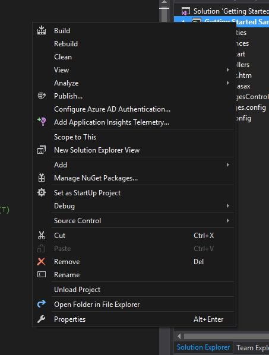
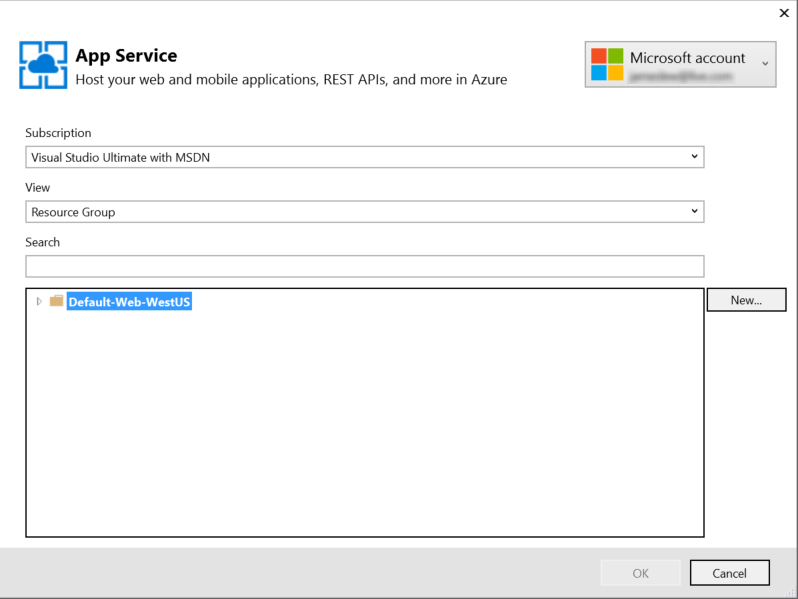
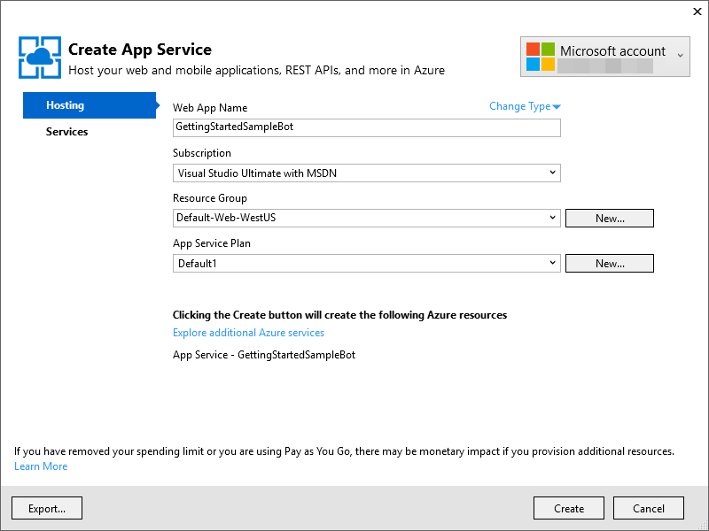
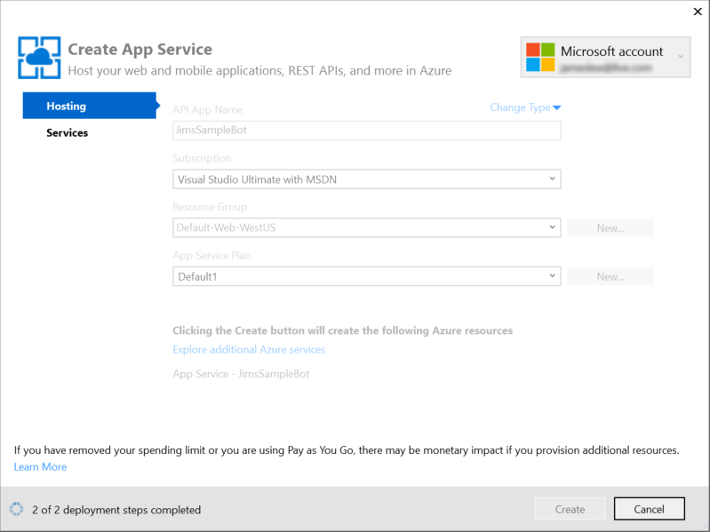
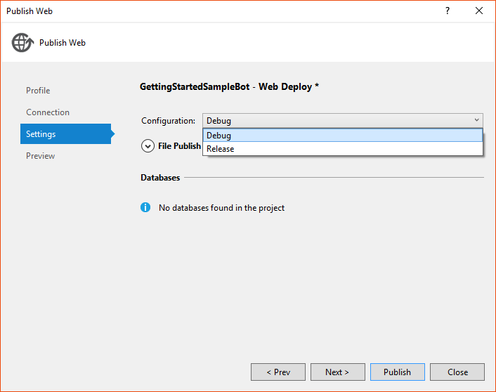

# Deploy a bot to Microsoft Azure

In this tutorial, we'll walk through the process of deploying a bot to Microsoft Azure using Microsoft Visual Studio 2015. 

> [!IMPORTANT]
> You must have a Microsoft Azure subscription before you can deploy your bot to Microsoft Azure. 
If you do not already have a subscription, you can register for a [free trial](https://azure.microsoft.com/en-us/free/) of Microsoft Azure.

## Launch the Microsoft Azure Publishing Wizard in Visual Studio

1. Open your project in Visual Studio.
2. In Solution Explorer, right-click on the project and select **Publish**. This starts the Microsoft Azure publishing wizard.

## Use the Azure Publishing Wizard to publish your bot to the cloud 

1. Select **Microsoft Azure App Service** as the project type and click **Next**.  

2. Create your App Service by clicking **New…** on the right side of the dialog.   

3. Click **Change Type** and change the service's type to Web App. 
Then, name your web app and fill out the rest of the information as appropriate for your implementation.   

4. Click **Create** to create your app service.   

5. Copy the **Destination URL** value to the clipboard 
(you'll need this value later to test the connection to the bot and to [register](bot-publish-register.md) it with the Bot Framework Developer Portal), 
and then click **Validate Connection** to verify that the settings have been configured correctly. 
If validation is successful, click **Next**.   

6. By default, your bot will be published in a Release configuration. 
(If you want to debug your bot, change **Configuration** to Debug.) 
Click **Publish** to publish your bot to Microsoft Azure.   

> [!NOTE]
> During the publishing process, you will see a number of messages displayed in the Visual Studio 2015 Output window. 
> When publishing completes, your bot's HTML page will be displayed in your default browser. 

## Test the connection to your bot

Verify the deployment of your bot by using the [Bot Framework Emulator](bot-framework-emulator.md). 

> [!TIP]
> Enter the URL of the newly deployed bot (i.e., the Destination URL copied to the clipboard in step 5 above) into the address bar of the Emulator.

## Next steps
In this tutorial, you deployed a bot to Microsoft Azure using Microsoft Visual Studio and 
then verified that the deployment was successful by testing the bot using the Bot Framework Emulator. 
As the next step in the publication process, you can now [register the bot](bot-publish-register.md) within the Bot Framework Developer Portal.

> [!NOTE]
> Although this tutorial uses Microsoft Azure, you can deploy your bot to any cloud service. 