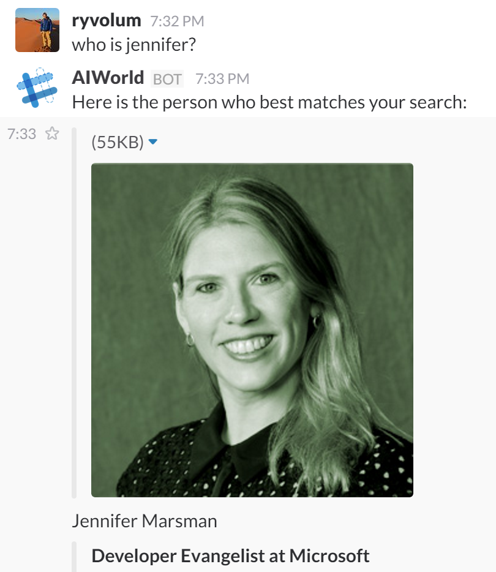
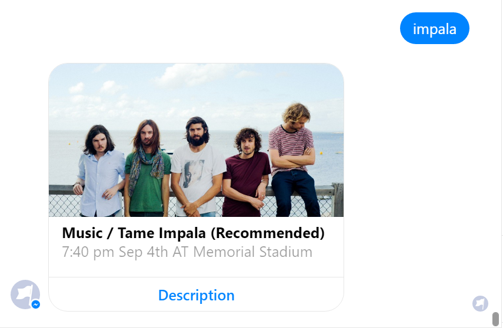
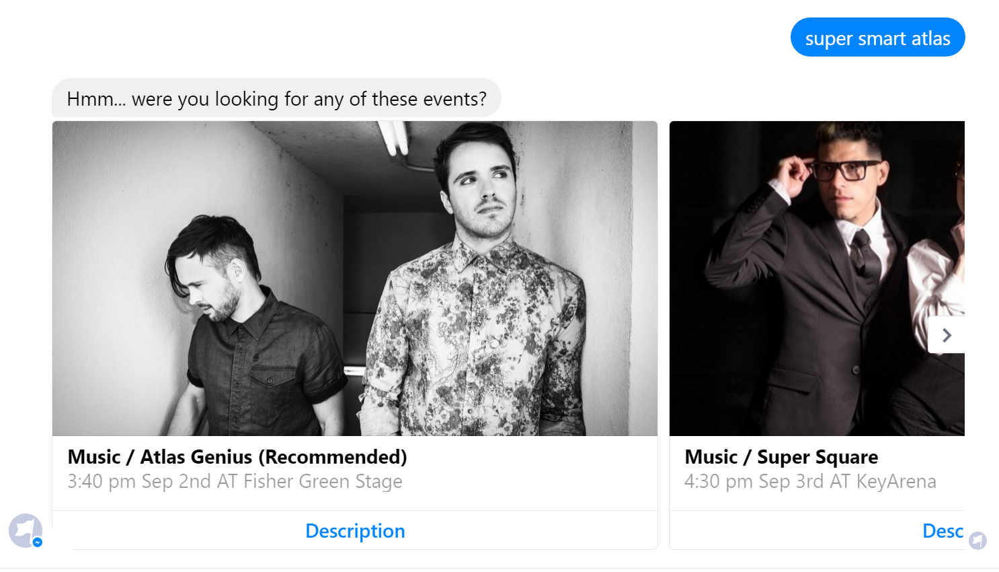
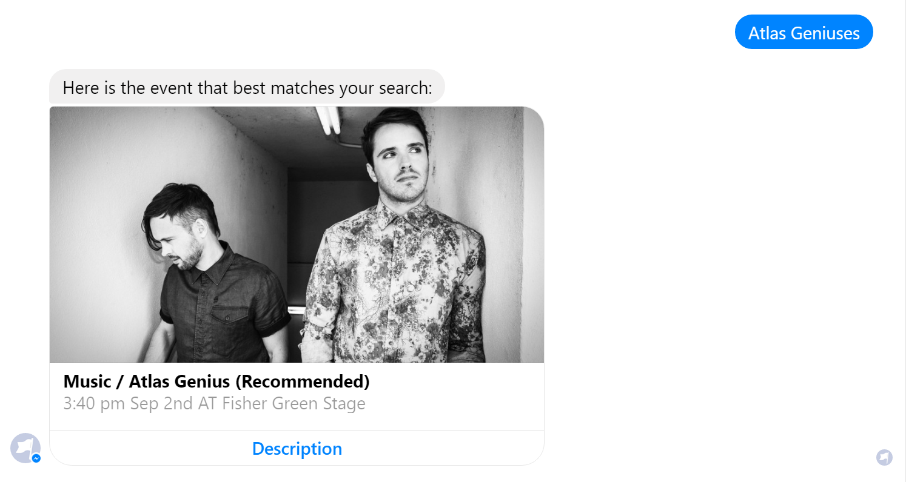
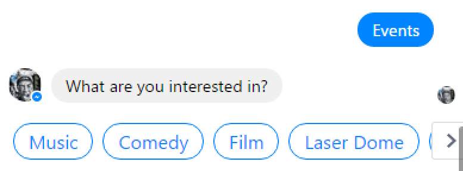
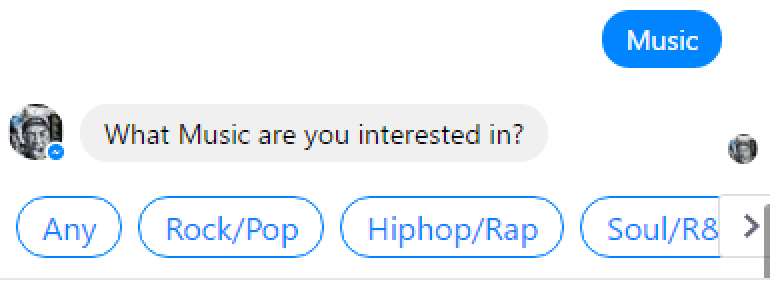
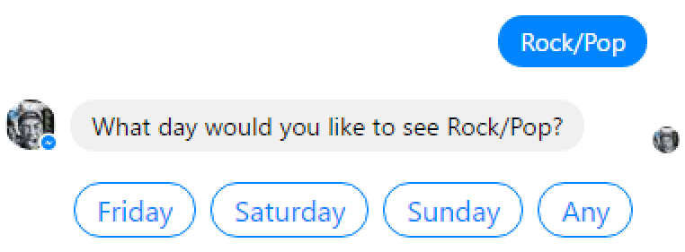

# Bot Design Center - Knowledge Base Bots

##Teaching bots to answer questions about any topic

We're frequently seeing the value of bots that can reason over a corpus of data to find and return a piece of information - we call these knowledge bots. Knowledge bots can be used in several scenarios:

* Event bot that answers questions like, "What bot events are there at this conference?", "When is the next Reggae show?" or "Who is Tame Impala?"
* Help desk bot that answers questions from help articles like "How do I update my operating system?" or "Where do I go to reset my password?"
* Contact bot that provides information about relevant contacts, answering questions like, "Who is John Doe?" or "What is Jane Doe's email address?"

In all cases, knowledge bots are informing their answer on some underlying data, be it relational data in a SQL database, JSON data in a non-relational store or PDFs in a document store. 

In building several of these bots we've stumbled upon some best practices, which we will delve into here. 

## Use existing services to build your knowledge bot

Bots are new user interfaces, but they can still leverage the same services we've used in app development. Knowledge bots necessarily require a data store, so storage services (relational or non-relational) are a necessary consideration. We might need to build an API to access that data, or analytics services to process it. Further, we may consider leveraging cognitive services, like the Knowledge Exploration Service to inform our bot. 

A particularly valuable tool to build bots with is search. Search algorithms enable a few interesting things for us:

For one, fuzzy search keeps users from having to type exact matches (e.g. "who is jennifer?" instead of "jennifer marsman", "impala" instead of "Tame Impala")

Search scores allow us to determine the confidence that we have about a specific search - allowing us to decide whether a piece of data is what a user is looking, order results based on our confidence, and curb our bot output based on confidence (e.g. "Hmm... were you looking for any of these events?" vs "Here is the event that best matches your search:") 

## A good knowledge bot should be more than just a search engine! 
I know, we just said that search is a great tool for building bots, but this doesn't mean that a bot should JUST be a search engine. Often we are approached by partners who wish to replace an ineffective search with a bot. Our response is generally that if their current search is ineffective, then their bot will probably be ineffective as well. A bot is just a new interface to existing data and services - that data needs to be massaged, indexed and organized to be effectively searched, regardless of the interface. 

If the primary motivation for building a bot is to perform a basic search, then you probably don't need a bot. Why use a conversational interface when a text bar on a website can perform the same functionality? Instead of using bots to perform basic searches, we can use them to guide a user to the data they are looking for. 

## Using Search to Guide a Conversation
Knowledge bots are generally most effective when they guide the conversation. Conversations are made up of a back-and-forth between a user and a bot. This enables bots to ask clarifying questions, present options, and validate outcomes in a way that a basic search is incapable of doing. In the following example we guide a user through a conversation that facets and filters a dataset until it finds what a user is looking for:

This bot clearly gives users information about the optional categories and guides them through the data. This is a considerably better experience than leaving the chat entirely open ended and having to accept any user input. Once users find the information that they are looking for, we can train them on the most efficient way to find that answer using natural language:

## Use natural language processing, but don't rely on it entirely

NLP is a powerful tool for picking out the intent of a message and parsing out the entities in that message. When working with huge datasets though, it is infeasible to train an NLP model with every example of an entity. In a music player bot for example, a user might message "Play Reggae", "Play Bob Marley", or "Play One Love". These would all map to the intent "playMusic", but without being trained with every artist, genre and song name, a natural language processing model will not be able to pick out whether the entity is a genre, artist or song. We can instead use the NLP model to give us back a generic entity of type "music" and search our data store for the entity to determine how to proceed. 

# Show me examples!

* Basic knowledge base music explorer bot in [C#](https://trpp24botsamples.visualstudio.com/_git/Code?path=%2FCSharp%2Fsample-KnowledgeBot&version=GBmaster&_a=contents)
* Basic knowldege base music explorer bot in [Node](https://trpp24botsamples.visualstudio.com/_git/Code?path=%2FNode&version=GBmaster&_a=contents)
* Complex knowledge base real estate and job listing bots in [C#](https://github.com/Microsoft/BotBuilder/tree/master/CSharp/Samples/SearchPoweredBots)
