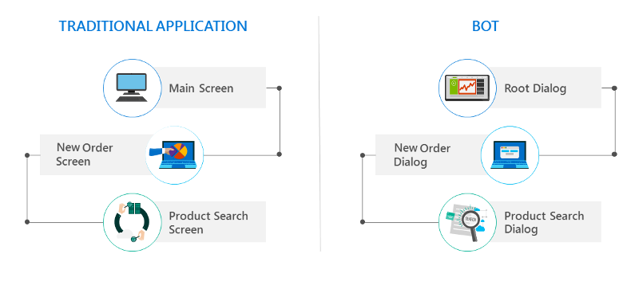

# Bot Design Center - Dialogs


##UI: Apps have them, so do bots 

In a traditional application, UI is represented as screens. A single app can use one or more screens as needed in order to exchange data with the user. You would likely have a main screen where all navigation starts from and then different screens for, let’s say, browsing products, looking for help and so on. Same principles apply to websites.

Again, bots are no different. You will have a UI. It just may look… different. As your bot grows in complexity, you will need to separate concerns. The place where you help the user browse for products will be different than the place where the user creates a new order or browses for help. We break those things into what we call “dialogs”. 

Dialogs may or may not have graphical interfaces. They may have buttons, text or they may even be completely speech based. One dialog can call another, just like screens in apps.



Developers are used with the concept of screens that "stack" on top of each other: The "main screen" invokes the "new order screen". At that point, "new order screen" takes over, as if it was on top of the main screen. The experience now is controlled by "new order screen" until it is done. It may even call other screens, which will then take over as well. But at some point, "new order screen" will be done with whatever it had to do so it will close, sending the user back to the main screen.

Let us switch to bots now: Our controller invokes the "main screen", which in this case we typically call the "root dialog".

In other words, in C#:


	```csharp

	public class MessagesController : ApiController
	{
        public async Task<HttpResponseMessage> Post([FromBody]Activity activity)
        {
				//controller redirects to RootDialog
                await Conversation.SendAsync(activity, () => new RootDialog()); 
	```

