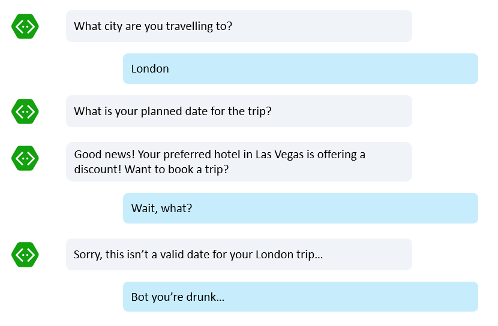

# Bot Design Center - Proactive Messages

##When the bot needs to take the first step

In the most typical scenario, the bot is usually reacting to a message received from the user. So the controller from the REST Service that hosts the bot receives a notification with the user's message and immediately creates a response from it.

But there are cases where what causes the bot to send a message to the user is something else, other than a message from the given user. Some examples are:

- A timed event, such as a timer: Maybe the bot had a reminder set and that time has arrived. 
- An external event: A notification from an external system or service needs to make its way to the user via the conversation between the user and the bot. For example, the price of a product that the bot has been monitoring based on a previous request from the user has been cut in 20%, so the bot needs to notify the user that such event occurred
- A question from the user may take too long to be answered, so the bot replies saying it will work on it and come back when it has the answer. Minutes, maybe days later, the bot initiates a message with the response obtained. 

 
It is important to note that although being able to initiate a message to the user is extremely useful, there are constraints to be noted:

- How often the bot sends messages to the user is something to be kept in mind. Different channels enforce different rules on that, but most of them will dislike a bot that spams users too frequently and will likely shut it down. Even if they don't, one has to be careful about the [captain obvious bot scenario discussed previously](../core/navigation.md#the-captain-obvious-bot): Notifications can become annoying very quickly.
- Many channels will only allow a bot to initiate a message to a user that has already had a previous conversation with the bot. In other words, at some point in the past the user launched that same bot and the bot took note of the user ID, channel ID and conversation ID. That way, the bot now is capable of reaching back to the user. The bot won't, though, be allowed to reach to a user who never user that bot. There are exceptions to this rule, specifically with e-mail and SMS.

##Not all proactive messages are the same

Before explaining this topic in too much detail, it is important to review [what we discussed about dialogs previously](../core/dialogs.md) and remember that dialogs stack on top of each other during a conversation.

When the bot decides to initiate a proactive message to the user, it is hard to tell whether such user is in the middle of a conversation or task with that same bot. This can become very confusing very quickly:

In the example above, the bot has been previously requested to monitor prices of a given hotel in Las Vegas. That generated a background monitoring task that has been continuously running for the past several days. Right now, the user is actively booking a trip to London. It turns out that exactly at that moment, the previously configured background task triggered a notification message about a discount for the Las Vegas hotel. But that caused an interruption to the existing conversation. When the user answered, the bot was back to the original dialog, awaiting for a date input for the London Trip. Confusing...

What would be the right solution here? 

- One option would be for the bot to wait for the current travel booking to finish, but the downside could be the user missing out the low price opportunity for the Las Vegas hotel. 
- Another option could be the bot to just cancel the current travel booking flow and tell the user that a more important thing came up. The downside in this case is that it could be frustrating for the user in the middle of a trip booking to have to start all over again.
- A third option could be for the bot to interrupt the current booking, change the conversation to the hotel in Las Vegas and once it gets a response from the user, switch back to the previous travel booking flow and continue from where it stopped. The downside in this case is complexity, both for the developer as well as to the user.

In other words, there is no "right answer". It really depends on what kind of notifications and what kind of flows the bot executes that might be interrupted because of such notifications.

So we will discuss basically two kinds of proactive messages that allow us to control and decide on any of the 3 cases discussed above:

##Ad-hoc and dialog based proactive messages

(TODO)

